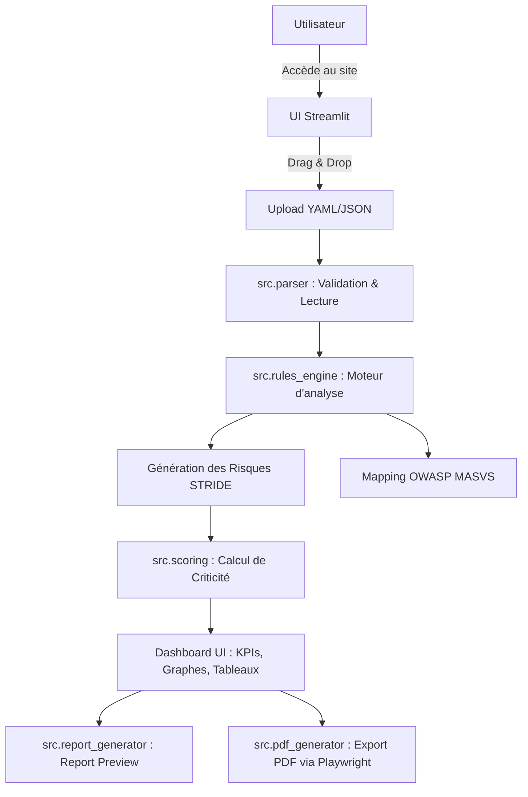
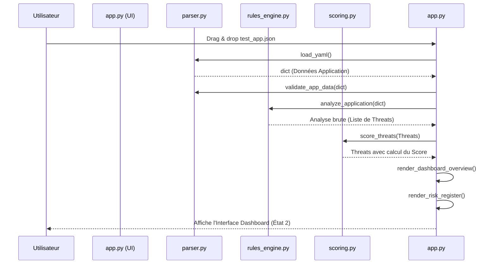
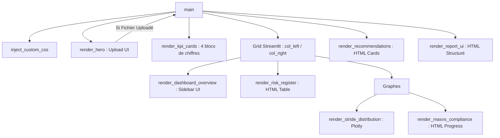

# Documentation détaillée : Threat Modeling Assistant

## 1. Vue d’ensemble du projet

**À quoi sert l’application ?**
Le "Threat Modeling Assistant" est un outil d'automatisation de la modélisation des menaces pour les applications mobiles. Il permet à une équipe de sécurité (SOC, DevSecOps) de générer instantanément un registre des risques en fournissant simplement la description de l'architecture d'une application.

**Le problème résolu :**
Le threat modeling manuel est long et complexe. Cet outil automatise la détection des failles en associant l'architecture de l'application à deux standards reconnus :
1. **STRIDE** (Spoofing, Tampering, Repudiation, Information Disclosure, Denial of Service, Elevation of Privilege) pour la catégorisation de la menace.
2. **OWASP MASVS 2.0** pour le respect des normes de sécurité mobile.

**Le parcours utilisateur principal :**
1. L'utilisateur arrive sur une landing page (État 1).
2. Il upload un fichier d'architecture au format `YAML` ou `JSON`.
3. L'application parse le fichier, déclenche un moteur de règles, calcule les scores de criticité, et génère des recommandations.
4. L'UI passe instantanément au "Dashboard" (État 2), affichant des KPI, des graphes interactifs, et un tableau des risques (Risk Register).
5. L'utilisateur peut exporter le rapport final généré en Markdown ou PDF.

---

## 2. Stack technique

- **Langage** : Python 3
- **Framework UI** : Streamlit (générateur d'interface web réactive en Python)
- **Manipulation de données** : `pandas` (pour le Risk Register et le traitement des tableaux)
- **Visualisation** : `plotly.express` (pour le graphique donut de distribution STRIDE)
- **Parsing** : `PyYAML` (pour lire les fichiers de configuration)
- **Génération de Rapports** :
  - `Jinja2` (pour templater le HTML et le Markdown)
  - `Playwright` via multiprocessing (pour la génération d'export PDF headless de très haute qualité)

---

## 3. Architecture globale

Le projet suit une architecture linéaire classique de traitement de la donnée ("Pipeline").



---

## 4. Structure des dossiers et fichiers

### `app.py`
- **Rôle :** Point d'entrée principal. C'est le chef d'orchestre de l'application.
- **Contenu :** Il gère toute l'interface utilisateur, la configuration de page, l'injection de CSS personnalisé (`inject_custom_css`), et relie l'UI aux fonctions backend (`main()`).

### `src/parser.py`
- **Rôle :** Sécuriser et transformer l'entrée utilisateur.
- **Contenu :** Fonction `load_yaml` qui décode le fichier et fonction `validate_app_data` qui s'assure que les champs obligatoires (ex: `app_name`, `endpoints`, `authentication`) sont présents.

### `src/rules_engine.py`
- **Rôle :** Le "Cerveau" de l'application. C'est ici qu'est stockée la logique métier.
- **Contenu :** Des petites fonctions de détection conditionnelles (`has_login`, `stores_tokens`, `has_api`). Si une condition est remplie, la fonction `generate_threats()` génère et retourne un objet "Menace" structuré.

### `src/scoring.py`
- **Rôle :** Mathématiques et pondération.
- **Contenu :** Fonctions `score_threats` et `calculate_global_risk`. Elles appliquent la formule de score de l'application : `Impact × Probabilité × Exposition` pour attribuer une étiquette textuelle (Critique, Élevé, Moyen, Faible).

### `src/report_generator.py` & `src/pdf_generator.py`
- **Rôle :** Création des livrables finaux.
- **Contenu :** Ils prennent les données JSON/YAML d'origine et la liste des menaces générées, puis utilisent Jinja2 pour les insérer dans un template. `pdf_generator.py` est particulièrement complexe : il lance un navigateur virtuel (`Playwright`) dans un processus Python séparé pour "imprimer" le HTML en PDF sans bloquer l'interface Streamlit.

---

## 5. Explication du code fichier par fichier

### `src/rules_engine.py`
Ce fichier est le cœur fonctionnel.
- **Les utilitaires (`has_keyword`, `text_blob`) :** Ils permettent d'analyser le JSON/YAML en cherchant des mots-clés spécifiques sans crasher si la donnée est mal formatée.
- **Les détecteurs (`has_login`, `stores_tokens`, `uses_http`) :** Ce sont des fonctions booléennes qui lisent les blocs du JSON. Par exemple, `uses_http` vérifie si une URL dans la liste "endpoints" commence par "http://".
- **La fonction `generate_threats(app_data)` :** C'est le chef d'orchestre des règles. Si `stores_tokens()` est Vrai, elle appelle la fonction `make_threat` avec des valeurs codées en dur pour générer une menace de type "Information Disclosure" mapée au "MASVS-STORAGE".

### `src/scoring.py`
- **`score_threats(threats)` :** Parcourt chaque menace, multiplie ses attributs bruts (`impact`, `probability`, `exposure`) et insère le résultat dans la clé `score`.
- **`classify_score(score)` :** Traduit l'entier mathématique en chaîne de caractères (<25 = Faible, >100 = Critique).

### `app.py`
- **Imports :** Importe Streamlit pour l'UI, et les fonctions backend du dossier `src/`.
- **`inject_custom_css()` :** Redéfinit massivement le CSS de Streamlit. Par exemple, il masque le header de base de Streamlit, force un fond `deep noir (#06090F)` et stylise le `stFileUploader`.
- **Les fonctions `render_*` :** Découpent la page en blocs logiques (`render_hero`, `render_kpi_cards`, `render_dashboard_overview`, `render_risk_register`). Elles n'ont aucune logique de calcul, elles font uniquement de l'affichage pur en HTML interpolé (f-strings).
- **Le Hook principal (`main`) :** Le flux est géré ici de manière séquentielle, selon la nature synchrone de Streamlit.

---

## 6. Flux de données détaillé (Sequence Diagram)

Que se passe-t-il exactement quand l'utilisateur dépose un fichier ?

1. L'événement est capté par le composant `st.file_uploader` qui renvoie un objet mémoire (`uploaded_file`).
2. Le bloc `if uploaded_file:` dans `main()` est déclenché.
3. Le fichier est passé à `parser.load_yaml`, qui renvoie un Dictionnaire Python.
4. Ce dictionnaire est audité par `validate_app_data`.
5. Si valide, il passe à `analyze_application()`. Cette fonction appelle l'extracteur d'assets, d'acteurs, et déclenche le moteur de règles pour récupérer la liste des `threats`.
6. La liste des `threats` passe dans le `score_threats` qui la modifie pour ajouter les scores mathématiques.
7. `app.py` appelle ensuite les différentes fonctions de rendu UI (ex: `render_risk_register`) en leur injectant directement le dictionnaire des menaces calculées.



---

## 7. Architecture des composants UI

Dans Streamlit, il n'y a pas de "composants enfants" avec une gestion d'état locale complexe (comme en React). Le "State" principal est simplement la présence ou l'absence du fichier uploadé.

Le parent est `main()`.



---

## 8. Modèle de données attendu (JSON)

Pour que l'application ne crashe pas, le JSON/YAML en entrée doit respecter les `REQUIRED_FIELDS` déclarés dans le parser.

**Exemple de JSON minimal accepté :**
```json
{
  "app_name": "FintechWallet",
  "description": "Application de paiement.",
  "app_type": "Mobile Android",
  "users": ["Client", "Admin"],
  "sensitive_data": ["email", "token", "historique bancaire"],
  "permissions": ["camera", "location"],
  "endpoints": [{"url": "https://api.bank.com/v1", "name": "API Centrale"}],
  "components": [{"name": "AuthActivity", "exported": true}],
  "authentication": {"type": "JWT", "login": true},
  "storage": {"local_database": "SQLite", "stores_tokens": true},
  "network_flows": ["REST API sur HTTPS"],
  "business_context": "Finance"
}
```

Une "Threat" générée par le système ressemblera ensuite à ce dictionnaire :
```python
{
    "id": "T-001",
    "threat": "Des tokens peuvent être extraits si le stockage local n’est pas chiffré.",
    "stride": "Information Disclosure",
    "asset": "Tokens d’authentification",
    "score": 80,  # Ajouté par scoring.py
    "level": "Élevé", # Ajouté par scoring.py
    "masvs": "MASVS-STORAGE"
}
```

---

## 9. Explication de l’UI et du CSS

L'aspect de l'application contourne les limitations visuelles de base de Streamlit :
- **Injection HTML brute :** Plutôt que d'utiliser les fonctions natives `st.table` (qui sont visuellement rigides), l'application construit des strings HTML géantes (avec `f""" <div style="..."> """`) puis demande à Streamlit de les rendre avec `st.markdown(..., unsafe_allow_html=True)`.
- **CSS Ciblé :** `inject_custom_css` modifie les classes internes de Streamlit. Par exemple :
  - `.block-container { padding-top: 0 !important; }` : Force la suppression de la marge haute classique de Streamlit.
  - `[data-testid="stFileUploader"] section` : Change complètement le design de la boîte de dépôt pour la rendre transparente et bordée de pointillés ("dashed border"), typique des vrais SaaS.
  - Il n'y a pas d'utilisation de TailwindCSS, tout le layout est géré en "inline CSS" (CSS direct dans les balises) ou via des classes définies dans l'injection globale.

---

## 10. Points forts & Choix techniques du projet

1. **Architecture découplée** : Le code de calcul (`src/`) est strictement séparé de l'interface (`app.py`). On pourrait théoriquement créer une API FastAPI avec le dossier `src` sans modifier une ligne de logique.
2. **Exécution Côté Serveur (sans DB)** : Streamlit exécute le code en Python. Le modèle ne nécessite aucune base de données ; il est "Stateless" (sans état), ce qui garantit une grande sécurité et rapidité d'exécution.
3. **Génération de PDF Async/Multiprocess** : L'utilisation d'une `queue multiprocessing` avec Playwright pour l'export PDF est un choix extrêmement robuste. Cela empêche le navigateur "headless" Chromium de faire planter l'interface utilisateur synchrone de Streamlit.
4. **Analyse Dynamique par Mots-Clés** : L'analyseur détecte des failles en parsant les mots (ex: s'il voit "sqlite" et "token", il déduit qu'il y a un risque de stockage local non chiffré).

---

## 11. Limites actuelles

1. **Règles en Dur (Hardcoding)** : Les règles de détection (les `if` dans `rules_engine.py`) sont écrites en dur dans le code Python. Pour ajouter une nouvelle faille à détecter, il faut coder une nouvelle fonction Python.
2. **Simplification du Scoring** : La formule mathématique ($Impact \times Probabilité \times Exposition$) utilise des valeurs subjectives arbitraires codées en dur dans le rules engine (ex: `impact=4`, `probability=3`).
3. **Aucune persistance** : Si l'utilisateur actualise la page avec F5, il perd toute son analyse, car il n'y a pas de base de données ni d'identifiant de session.

---

## 12. Améliorations possibles

1. **Moteur de règles dynamique (JSON/Base de données)** : Externaliser les règles dans un fichier JSON ou une base PostgreSQL. Au lieu de `if uses_http():`, on bouclerait sur des règles de détection dynamiques. Cela permettrait à des analystes sécurité de créer des règles sans toucher au code.
2. **Graphe interactif d'architecture (Data Flow Diagram)** : Générer un graphe technique de l'architecture de l'application uploadée.
3. **Validation par Schéma (Pydantic)** : Actuellement, le parser vérifie l'existence de clés (`if "endpoints" in data`). L'utilisation de **Pydantic** permettrait de valider finement les types de chaque champ (ex: vérifier que "endpoints" est bien une liste d'URLs).

---

## 13. Résumé pour présentation orale (1 min 30)

> "Bonjour à tous. Le projet que nous vous présentons est le **Threat Modeling Assistant**, une application SaaS conçue pour les équipes DevSecOps. 
>
> Le problème qu'il résout est simple : la modélisation des menaces d'une architecture mobile est une tâche chronophage et manuelle. Notre outil automatise cela. 
> 
> L'architecture technique repose sur un backend en **Python** propulsé par une interface **Streamlit**. L'utilisateur dépose un fichier YAML ou JSON qui décrit son application (endpoints, données stockées, authentification). Notre moteur, le `rules_engine`, va parser ces données, détecter par analyse sémantique la présence d'éléments sensibles, et générer dynamiquement un tableau des risques.
> 
> Chaque vulnérabilité détectée est automatiquement cartographiée selon le framework **STRIDE** et mappée à la norme de sécurité mobile **OWASP MASVS**. L'outil calcule mathématiquement la sévérité et propose des remédiations.
> 
> La force du projet réside dans son architecture modulaire et "stateless" (aucun stockage de données utilisateur), ainsi que dans sa capacité à générer un rapport PDF ultra-détaillé en utilisant Playwright en arrière-plan. Bien que les règles de détection soient aujourd'hui statiques dans le code, l'outil est prêt à pivoter vers un moteur de règles dynamique alimenté par base de données. C'est un gain de temps majeur pour les équipes d'audit."
